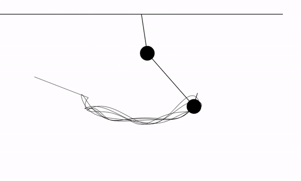
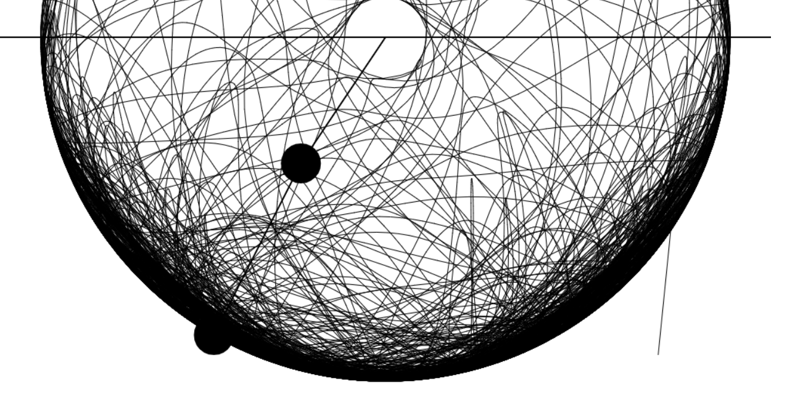

# Double Pendulum

In this repository I use the p5.js framework to create an example of a _double pendulum_.

Wherever you press with your mouse of the canvas the first pendulum will appear there, and second one, from a position randomly chosen.

Try it yourself!

This is the result:

If you have patience you will eventually see something like this:

